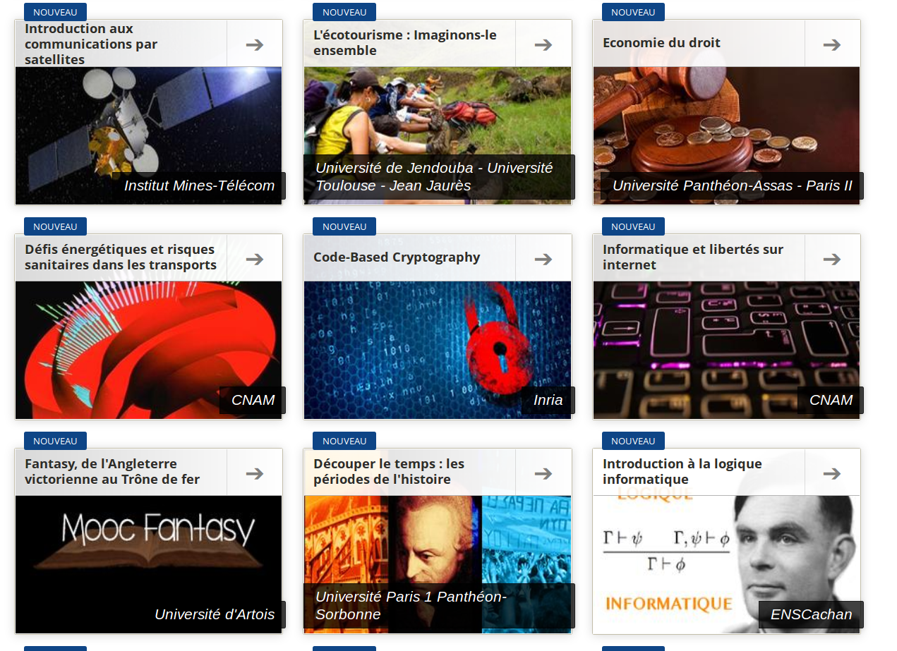
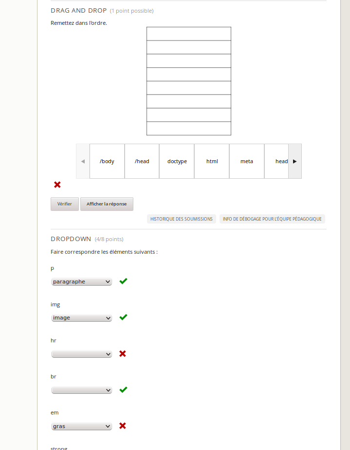
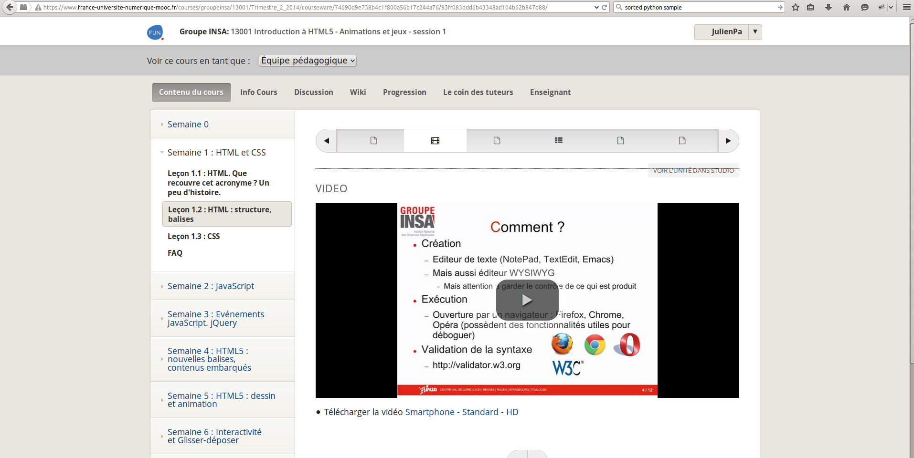
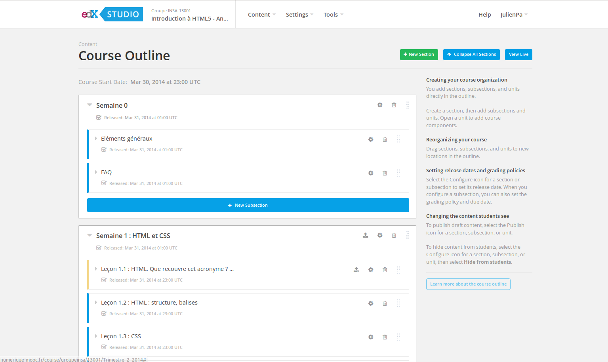

# Présentation générale {#presentation}

Edx est une platforme web qui permet de délivrer des cours en ligne ouverts à tous, les MOOCs - Massive Online Open Courses.

Les cours sont édités dans le « Studio ». Le Studio est une section réservée aux enseignants et aux personnes responsables de maintenir les cours. Il s'agit d'une interface web d'où l'on peut éditer les contenus de cours, gérer les vidéos et les autres ressources à destination des apprenants. Depuis le Studio, on peut gérer les calendriers de cours, gérer les barêmes de notation des apprenants, concevoir les quiz, etc.

Le LMS - Learning Management System, est la section publique de la plateforme Edx. Les cours qui sont édités dans le Studio sont publiés dans le LMS et disponibles aux apprenants. Le LMS est la partie la plus exposée et permet notamment aux apprenants de se connecter et de suivre leur cours. Il s'agit de https://www.france-universite-numerique-mooc.fr par exemple. Les apprenants peuvent s'inscrirent, consulter les cours, répondre aux quiz, accéder aux résultats, etc.

## LMS et Studio

Lorsque vous installez OpenFUN ou OpenEdX, vous aurez les deux "sites" LMS et Studio sur votre machine de dévelopement.

Les moocs ne sont pas composés uniquement de vidéos de cours. Ils s'accompagnent aussi de nombreuses activités, jeux ...

Les étudiants suivent des moocs depuis le *LMS* (Learning Management System):

Et les professeurs concoivent ces moocs depuis un *CMS* (Content Management System), appelé aussi *Studio*:

