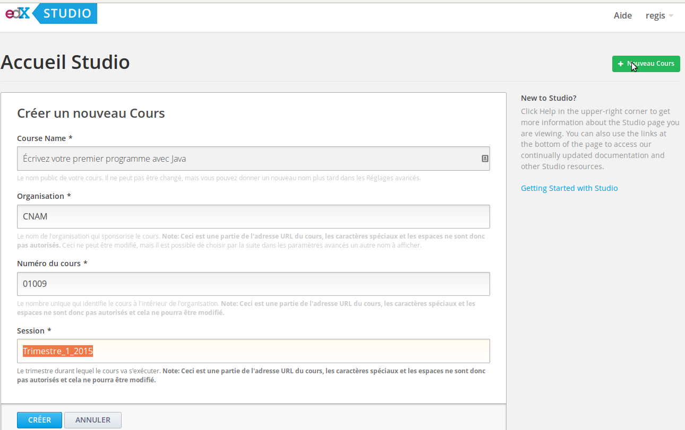

# Installation d'une machine virtuelle OpenFUN / edX / IONISx {#install}

Les composants nécessaires à l'installation de FUN ou d'edX sont nombreux et
relativement complexes ; c'est pourquoi il existe des machines virtuelles (VM)
disponibles en simple téléchargement qui permettent de commencer rapidement à
tester ces applications. Dans la suite de cette section, nous allons voir les
étapes à suivre pour obtenir un environnement de développement fonctionnel.

## Prérequis

- Configuration recommandée : Ubuntu/Linux 14.04
- VirtualBox >= 4.3.12
- Vagrant >= 1.6.5

## Téléchargement (optionnel mais fortement recommandé)

Les VM OpenFUN sont disponibles au téléchargement via bittorrent. Si vous ne
disposez pas d'un client bittorrent (tel que
[Transmission](http://www.transmissionbt.com/), [Vuze](http://www.vuze.com/) ou
[Deluge](http://deluge-torrent.org/)),
vous devrez télécharger les VM en HTTP, ce qui risque d'être plus lent et de
saturer les serveurs de FUN.

Les fichiers .torrent correspondant aux différentes version d'OpenFUN sont
disponibles ici : [http://files.alt.openfun.fr/vagrant-images/fun/](http://files.alt.openfun.fr/vagrant-images/fun/)

Vous pouvez télécharger le fichier openfun-\*.torrent correspondant à la
version la plus récente d'OpenFUN dans votre client bittorrent favori.

Avant de créer votre VM, il faudra indiquer à Vagrant le répertoire dans lequel vous avez téléchargé les images :

    export VAGRANT_BOXES=/chemin/vers/mon/repertoire/de/torrents/
    export FUN_RELEASE=2.13 # Si vous avez téléchargé la version 2.13 d'OpenFUN

## Clonage des dépôts de code Open edx et OpenFUN (optionnel mais recommandé aux développeurs)

Cette étape optionnelle est néanmoins bien pratique si vous comptez contribuer
au code d'Open edX ou de FUN. En effet, vous voudrez vraisemblablement éditer
le code source dans votre machine hôte avec votre IDE favori avant de voir le
résultat dans votre VM. Pour cela :

    # Choisissez un répertoire dans lequel cloner les dépôts de code nécessaires
    mkdir /home/user/repos
    cd /home/user/repos/

    # fun-apps : la branche 'dev' est la branche de développement
    git clone https://github.com/openfun/fun-apps
    cd fun-apps && git checkout dev && cd -
    
    # edx-platform : nous utilisons la branche associée à la release
    git clone https://github.com/openfun/edx-platform # cela peut prendre un peu de temps...
    cd edx-platform && git checkout fun/release-$FUN_RELEASE && cd -
    
    # Utilisation du thème FUN
    mkdir themes && git clone https://github.com/openfun/edx-theme themes/fun/
    cd themes/fun/ && git checkout dev && cd -
    
    # Indiquez à Vagrant le répertoire dans lequel vous avez cloné les dépôts
    export VAGRANT_MOUNT_BASE=/home/user/repos

## Lancement de la machine virtuelle

Après avoir (éventuellement) réalisé les étapes ci-dessus, vous êtes prêt à
lancer votre machine virtuelle.  Pour cela, clonez le dépôt fun-boxes :

    git clone https://github.com/openfun/fun-boxes
    # le readme est plein d'instructions fort utiles
    cat fun-boxes/README.rst

Lancez votre machine virtuelle :

    cd fun-boxes/releases/
    vagrant up --no-provision 

Notez que nous utilisons `--no-provision` : c'est parce que l'image téléchargée
est déjà configurée et n'a donc pas besoin d'être "provisionnée" par Vagrant.
Le provisionnement peut prendre plus ou moins longtemps, selon la qualité de
votre connexion internet...

En cas de problème, pensez à consulter le README dans lequel votre problème est
peut-être déjà décrit.

## Lancement d'un serveur web

Si vous avez correctement lancé votre machine virtuelle, vous pouvez maintenant
vous y connecter via ssh et lancer un serveur web local :


    ######### Commande exécutée sur votre machine hôte
    vagrant ssh

    ######### Commandes exécutées dans la VM
    
    # La plupart des applications sont exécutées par l'utilisateur edxapp
    sudo su edxapp

    # Cette commande réalise à la fois l'installation des dépendances, la
    # collecte des données statiques et le lancement de l'application LMS
    fun lms.dev run

Ouvrez maintenant votre navigateur (de votre machine hôte) à l'adresse
[http://127.0.0.1:8000](http://127.0.0.1:8000) : vous devriez voir apparaître la page d'accueil de FUN.
Win!

    # Pour sauter les phases de vérification de l'environnement, vous pouvez
    # exécuter à la place de la commande précédente :
    fun lms.dev run --fast

    # De même, dans un autre terminal, vous pouvez lancer le Studio/CMS :
    fun cms.dev run --fast

Le Studio/CMS est alors visible à l'adresse http://127.0.0.1:8001.

Vous pouvez également lancer les tests associés à FUN :

    # Notez que les settings de test sont différents de ceux de dev
    fun lms.test test ../fun-apps/
    fun cms.test test ../fun-apps/

Sous le capot, `fun` est un raccourci permettant d'exécuter une variété de
commandes Django. Pour plus d'informations, consultez la documentation de
fun-cmd :
[https://github.com/openfun/fun-cmd](https://github.com/openfun/fun-cmd)

## Le forum

Le forum fonctionne avec un service REST Ruby qui utilise Mongo pour stocker
les messages, ElasticSearch pour les indexer et un client Django qui se trouve
dans le dépôt `edx-platform`.

Pour pouvoir utiliser les forums dans le LMS, vous devrez donc démarrer le
service REST, comme suit :

    sudo su forum
    ruby app.rb -p 18080

## edX sans le FUN

Il est tout à fait possible de faire tourner Open edX sans la surcouche FUN. Pour éviter d'avoir à reprovisionner la VM, FUN fournit des images déjà provisionnées. Par exemple, la dernière version (birch) d'Open edX peut être téléchargée [ici](http://files.alt.openfun.fr/vagrant-images/edx/).

Le lancement de la VM s'effectue à peu près de la même manière que précédemment :

    cd fun-boxes/edx/
    export VAGRANT_BOXES=/chemin/vers/mon/repertoire/de/torrents/
    vagrant up

Vous pouvez alors vous connecter à votre VM et lancer le LMS ou le Studio :

    vagrant ssh
    sudo su edxapp

    paver devstack lms
    paver devstack studio

Plus de documentation est disponible [sur le site d'Open edX](https://github.com/edx/configuration/wiki/edX-Developer-Stack).

## Installation de la plateform IONISx

De la même manière que FUN, IONISx propose une version d'Open edX dotée d'un thème personnalisé. L'environnement de développement IONISx peut être simplement installé en une commande :

```shell
curl -sL http://hack.ioni.sx/birch | sh
```

La commande ci-dessus va installer une *devstack* Open edX, comprenant les composants de la plateforme suivants :

* [LMS](https://github.com/edx/edx-platform) avec le [*responsive theme* IONISx](https://github.com/IONISx/edx-theme)
* [Studio](https://github.com/edx/edx-platform)
* [Forum](https://github.com/edx/cs_comments_service)
 
### Gestion

Une fois votre *devstack* Open edX installée, vous avez trois nouveaux répertoires dans votre dossier courant :

* `edx-platform`
* `themes`
* `cs_comments_service`

Ces répertoires sont les dépôts [Git](https://git-scm.com/) des différentes applications listées ci-dessus.
Ils sont synchronisés avec votre machine virtuelle.

Pour vous connecter à la machine virtuelle, entrez

```shell
vagrant ssh
```

#### LMS

Pour lancer le LMS, depuis votre machine virtuelle, connectez-vous avec l’utilisateur `edxapp` :

```shell
sudo su edxapp
```

Vous allez automatiquement être placé dans le répertoire `/edx/app/edxapp/edx-platform` (synchronisé avec le répertoire `edx-platform` sur votre machine physique).

Lancez le LMS avec la commande suivante :

```shell
paver devstack lms
```

Vous pouvez maintenant naviguer sur le LMS, sur votre machine physique, en vous rendant sur [http://localhost:8000](http://localhost:8000).

#### Studio

Pour lancer Studio, de la même manière que pour le LMS, lancez

```shell
paver devstack studio
```

Accédez à Studio, sur votre machine physique, en vous rendant sur [http://localhost:8001](http://localhost:8001).

## Se connecter au LMS/CMS

Apres l'installation vous pouvez vous connecter au Lms ou au Studio avec les
utilisateurs suivants :

| Nom d’utilisateur | Mot de passe |
| -- | -- |
| staff@example.com | edx |
| honor@example.com | edx |
| audit@example.com | edx |


## Import d'un cours dans le Studio

Votre instance de edX/FUN est pour l'instant vide de cours. Vous pouvez importer un cours existant dans le studio. Pour cela, il suffit de créer un cours, comme suit :



Une fois que le cours est créé, allez dans Outils -> Importer. Téléchargez [ce
cours sur
Java](http://files.alt.openfun.fr/courses/CNAM%20Ecrivez%20votre%20premier%20cours%20en%20Java.tar.gz)
gracieusement fourni par le CNAM. Puis cliquez sur "Choisissez un fichier à
importer" et sélectionner ce fichier que vous venez de télépcharger. Ce cours
est maintenant disponible dans le LMS et vous pouvez le visualiser dans [la
liste des cours](http://127.0.0.1:8000/cours/).

## Soucis avec la VM

Il a été constaté que l'application est parfois très lente, voire se bloque
complètement. Ceci est dû à un problème de lenteur de la fonction
`gethostbyname` dans votre machine virtuelle. Voir [ici la version longue des
explications](http://stackoverflow.com/questions/28562968/django-1-4-18-dev-server-slow-to-respond-under-virtualbox/30356662#30356662).

La solution consiste à rajouter l'adresse de votre gateway (dans la plupart des
cas : `10.0.2.2 10.0.2.2`) dans le fichier `/etc/hosts` de votre machine
virtuelle.

Pour la résolution d'autres problèmes, consulter [le README de fun-boxes](https://github.com/openfun/fun-boxes).
