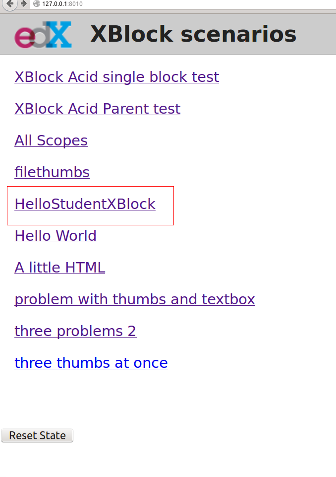
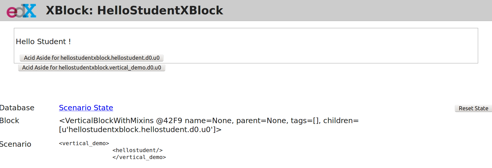

# Mon premier Xblock 'Hello Student!'{#xblocks}

Les XBlocks enrichisse les contenu de cours : il existe des XBlock pour afficher des vidéos dans le cours, pour y insérer des quiz, pour permettre des discussions de forum, ou même pour exécuter des lignes code. Edx met à disposition un SDK qui aide à la création de XBlocks. Ainsi, il est possible commencer le développement de vos modules XBlock sans avoir à installer la platforme Edx.

Vous trouverez dans ce guide, les instructions pour installer le SDK et pour créer votre premier XBlock.

### Installer Python

    sudo apt-get install python

### Installer Pip

 Pip est un gestionnaire de dépendance python.
 
 Pour une installation sous Debian/Ubuntu
 
     sudo apt-get install python-pip
 
 Une autre façon d'installer pip en téléchargeant le script `https://bootstrap.pypa.io/get-pip.py`:
 
    wget https://bootstrap.pypa.io/get-pip.py -P /tmp/ && sudo python /tmp/get-pip.py

### Installer le xblock sdk depuis le dépot Github

    sudo apt-get install python-virtualenv
    mkdir -p ~/venvs/
    virtualenv ~/venvs/xblock-sdk
    source ~/venvs/xblock-sdk/bin/activate
    cd ~/
    git clone https://github.com/edx/xblock-sdk.git
    cd ~/xblock-sdk/
    make install
    python manage.py syncdb

### Lancer le serveur de développement

    python manage.py runserver 0:8001

Maintenant depuis votre navigateur allez à cette adresse 127.0.0.1:8001.
Si tout va bien la page suivante devrait apparaître :

### Créons la structure de notre xblock

        # Le code du xblock sera dans le dossier ~/xblock-dev/
        mkdir ~/xblock-dev/
        cd ~/xblock-dev/
        python ~/xblock-sdk/script/startnew.py 

Le script demande d'abord un nom court pour notre xblock, choisissons 'hellostudent'.
Ensuite rentrons le nom de classe 'HelloStudentXBlock'

Nous avons maitenant un dossier 'hellostudent' contenant la structure du XBlock.

### Afficher 'Hello student'

Ouvrons le fichier `hellostudent/static/html/hellostudent.html` et remplaçons son contenu par :

    

        

             Hello Student !
         

    

### Enregistrer notre xbock dans le workbench.

Pour afficher notre xblock il est nécessaire de l'installer dans l'environnement de travail, le 'workbench'. L'installation est controlée par fichier `setup.py` qu'il faudra modifier pour l'adapter à nos besoin.

        # Se mettre dans l'environnement virtuel avant l'installation du paquet.
        source ~/venvs/xblock-sdk/bin/activate
        cd ~/xblock-dev/hellostudent/
        pip install .

Ici, nous travaillons dans le contexte du SDK, mais sachez que ce même principe utilisant `pip install` est utilisé pour installer un XBlock dans la plateforme Edx.

Vous devriez maintenant avoir un environement minial complet. 

Pour rappel, les commandes pour démarrer le serveur:

    source ~/venvs/xblock-sdk/bin/activate
    cd ~/xblock-dev/hellostudent/
    python manage.py runserver 0:8001

Voici ce que vous devriez voir:

