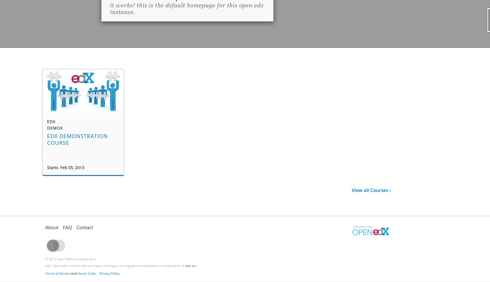
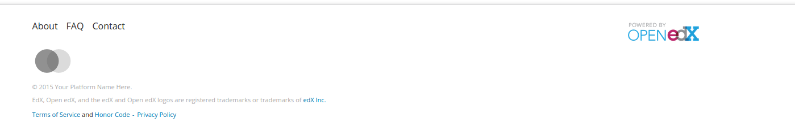
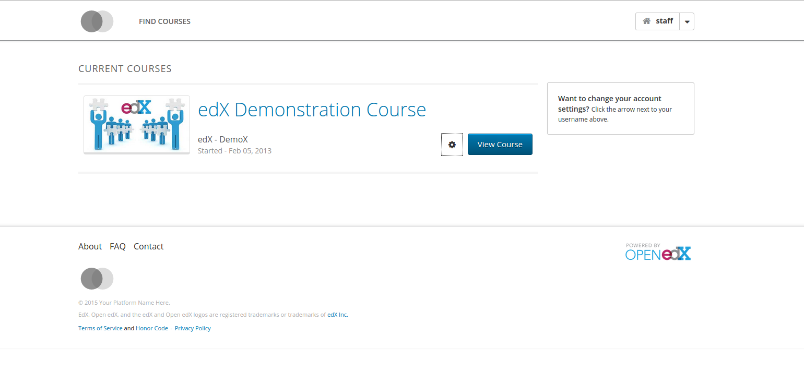
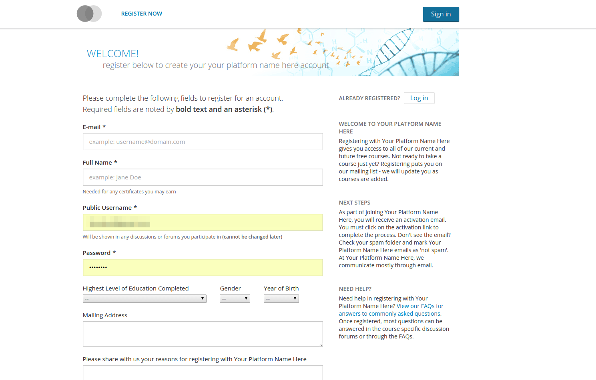
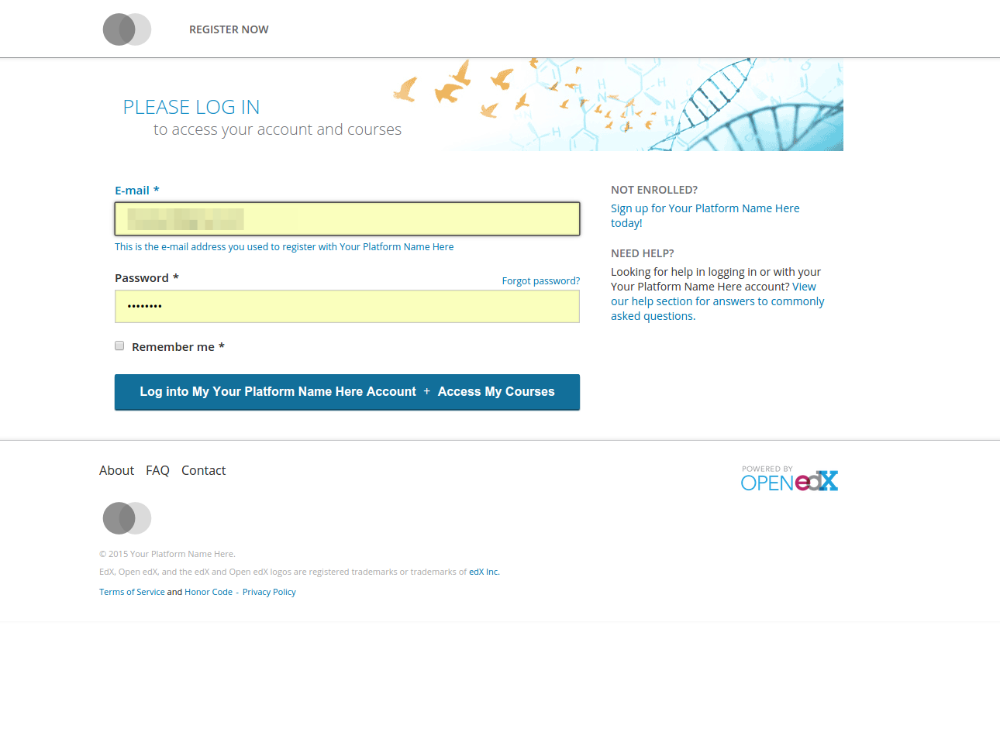
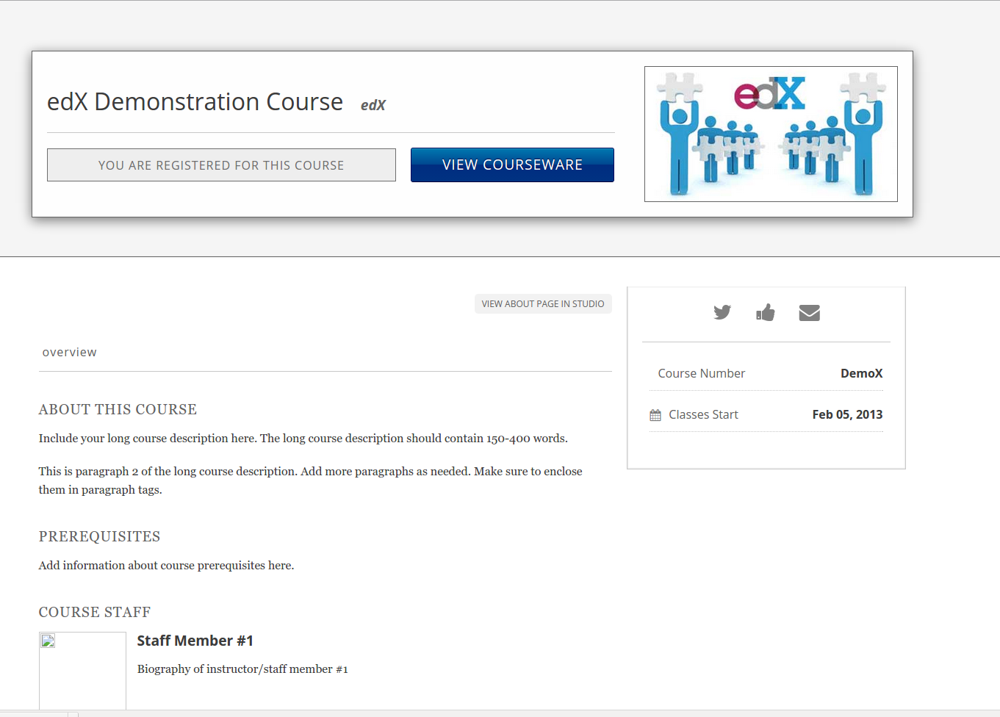
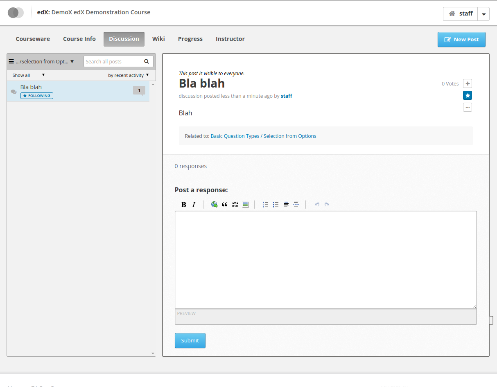
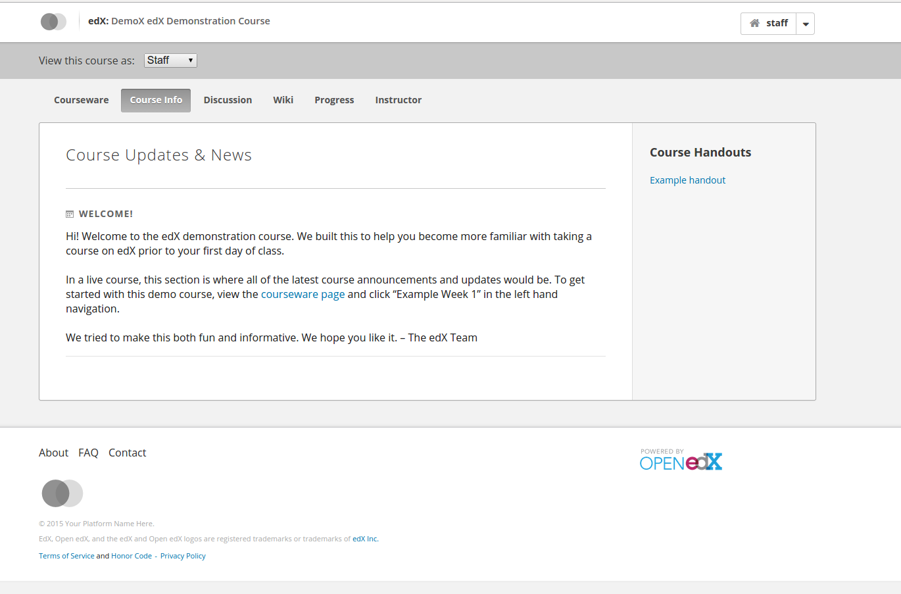

# A quoi ça ressemble ?

A la fin de ce document vous disposez de quelques photos d'écran annotées de quelques phrases pour décrire la
manière dont Open edX se présente de manière standard.

Ce que nous pouvons retenir:
* Le LMS est beaucoup plus configurable que le CMS/Studio et les thèmes ne marchent **que pour le LMS** grâce au Thème Standford (voir prochain chapitre).

* Il reste quelques soucis d'ergonomies et de présentation à l'intérieur du cours. Cela est beaucoup plus difficile
à adresser de manière efficace et compatible avec les mise à jour. Néanmoins nous n'allons pas poser de limites
aux changements tant que cela se passe à l'extérieur du code "source" d'Open edX (à la manière Standford Thème). Par exemple:
  1. Le contenu d'un cours: limité à une taille maximale en largeur et ne met pas assez en valeur le contenu.
  2. Les forums ont gagné en ergonomie mais restent toujours peu intuitifs
  (notamment pour l'enseignant, il est parfois difficile de s'y repérer)

# Modifier l'apparence d'Open edX

Notez bien que ces solutions sont valides seulement pour le LMS.

## Solution 1 : Thème Standford

Solution à l'origine proposée par Stanford et utilisée par FUN et IonisX.

Le document original est ici : [https://github.com/edx/edx-platform/wiki/Stanford-Theming](https://github.com/edx/edx-platform/wiki/Stanford-Theming) et là [https://github.com/Stanford-Online/edx-theme](https://github.com/Stanford-Online/edx-theme).

Les étapes sont:
1. Modifiez le fichier de configuration /edx/app/edxapp/lms.env.json et les variables FEATURES.USE_CUSTOM_THEME, THEME_NAME et PLATFORM_NAME
2. Mettez votre thème dans /edx/app/edxapp/themes/

### Pas à pas avec le "Standford Theme"

1. Clonez le projet [https://github.com/Stanford-Online/edx-theme](https://github.com/Stanford-Online/edx-theme) dans le répertoire /edx/app/edxapp/themes/

2. Renommez le fichier \_default.sccs vers le nom de votre thème (ici edx-theme):

```
  mv /edx/app/edxapp/themes/edx-theme /edx/app/edxapp/themes/default
```

3. Changez votre configuration

Exemple de configuration lms.env.json (extrait):


"FEATURES": {
        "AUTH_USE_OPENID_PROVIDER": true,
...
        "USE_CUSTOM_THEME": true
    },
...
  THEME_NAME": "default",



Redémarrez votre serveur pour recompiler les "assets" (parties statiques, fichiers css et javascripts).

## Thème IonisX

Même procédure que le thème Stanford excepté qu'il faut cloner le thème IonisX
[https://github.com/IONISx/edx-theme/](https://github.com/IONISx/edx-theme/)
La documentation est dans le README.md

## Thème FUN

Le thème FUN est plus facilement installé grâce aux machines virtuelles disponibles (voir documentation d'installation).

[https://github.com/openfun/edx-theme](https://github.com/openfun/edx-theme)
La documentation est dans le README.md


# Liens Utiles

## Thème Stanford (utilisé par FUN-MOOC)

[https://github.com/Stanford-Online/edx-theme](https://github.com/Stanford-Online/edx-theme)
[https://github.com/edx/edx-platform/wiki/Stanford-Theming](https://github.com/edx/edx-platform/wiki/Stanford-Theming)


## Exemples de thèmes

[https://github.com/edx/edx-platform/wiki/Sites-powered-by-Open-edX](https://github.com/edx/edx-platform/wiki/Sites-powered-by-Open-edX)

## Documentation générale

[https://github.com/edx/edx-platform/wiki/Javascript-standards-for-the-edx-platform](https://github.com/edx/edx-platform/wiki/Javascript-standards-for-the-edx-platform)

[https://github.com/edx/edx-platform/wiki/Alternate-site-for-marketing-links](https://github.com/edx/edx-platform/wiki/Alternate-site-for-marketing-links)

# Photos d'écran et suggestions

## Ecran d'accueuil et écrans externes au cours

Facile à mettre à jour dans le thème par le (header et footer). On peut vraiment améliorer l'ergonomie ici.
Notez bien qu'il existe aussi des pages statiques que l'on peut changer aussi facilement (voir [https://github.com/edx/edx-platform/wiki/Alternate-site-for-marketing-links](https://github.com/edx/edx-platform/wiki/Alternate-site-for-marketing-links)

###L'écran d'accueil



###Le footer



###Le tableau de bord étudiant et sa liste des cours



## Pages d'inscription et de connexion

Là aussi un travail d'ergonomie peut être fait:

### S'inscrire



### Se connecter



## Le syllabus d'un cours

Regardez les différents exemples de thèmes (IonisX et FUN) pour voir à quoi cela ressemble sur un site un peu plus fournis en contenu.

Notez qu'edX (edx.org) n'utilise pas edX pour affichers ses syllabus mais qu'il y a de très bonnes idées dans leur présentation:

### Le syllabus d'un cours



## Intérieur d'un cours

Là aussi des améliorations peuvent être pensées. Sachez tout de même que cela reste plus difficile à maintenir sur une plateforme en production à cause des nombreuses mises à jour.

### Le forum



### Le contenu du cours


