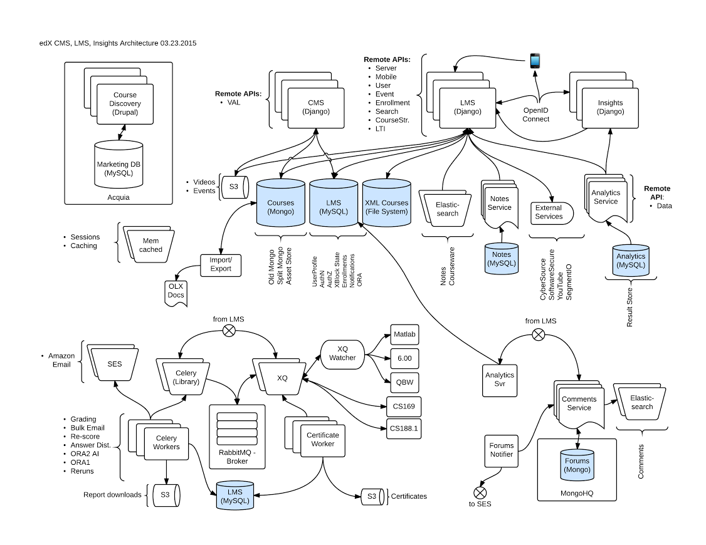

# Administration

### MySQL

Vous pouvez acceder au shell MySQL avec l'utilisateur `edxapp001`, le mot de passe est `password` :

    mysql -u edxapp001 -p

Vous pouvez aussi y acceder via Django et la commande `fun` :

    fun lms.dev dbshell

### MongoDB

Quelques commande pour acceder aux collections Mongo :

    $ mongo
    MongoDB shell version: 2.6.6
    connecting to: test
    > show dbs
    admin                            0.078GB
    cs_comments_service_development  0.078GB
    edxapp                           0.453GB
    local                            0.078GB
    > use edxapp
    switched to db edxapp
    > show collections
    assetstore
    fs.chunks
    fs.files
    modulestore
    system.indexes
    > db.modulestore.find()

Apres un reboot de la machine virtuelle, il arrive que le service Mongo ne redemarre pas.

    File "/edx/app/edxapp/venvs/edxapp/local/lib/python2.7/site-packages/pymongo/mongo_client.py", line 369, in __init__
        raise ConnectionFailure(str(e))
    ConnectionFailure: [Errno 111] Connection refused

Pour résoudre ce problème:
    
    sudo rm /edx/var/mongo/mongodb/mongod.lock
    sudo service mongod restart

### ElasticSearch

Le service ElasticSearch écoute sur le port 9200:

    curl localhost:9200
    {
      "ok" : true,
      "status" : 200,
      "name" : "Manbot",
      "version" : {
        "number" : "0.90.11",
        "build_hash" : "11da1bacf39cec400fd97581668acb2c5450516c",
        "build_timestamp" : "2014-02-03T15:27:39Z",
        "build_snapshot" : false,
        "lucene_version" : "4.6"
      },
      "tagline" : "You Know, for Search"
    }
    

### Les logs

Les fichiers de logs propres à edX se trouvent dans `/edx/var/log/`

Les logs applicatifs studio et lms:

    sudo tail -f /edx/var/log/lms/edx.log
    sudo tail -f /edx/var/log/cms/edx.log

Les tracking logs qui agrègent le comportement des utilisateurs du lms :

    /edx/var/log/tracking

## Architecture générale

Comme précisé dans le document suivant [Open edX Architecture](https://open.edx.org/contributing-to-edx/architecture), la plateforme se base notamment sur les technologies suivantes:
- Python
- Django
- Mako Templates
- CoffeeScript
- Backbone.js
- Sass et Bourbon
- Ruby (Forum)

Sur le plan des composants:
- Le LMS
- Le studio
- Les bases de données (MySQL pour les données étudiants et administration, Mongodb pour la structure de cours et données des forums)

Voici un schéma général d'une installation Open edX:

