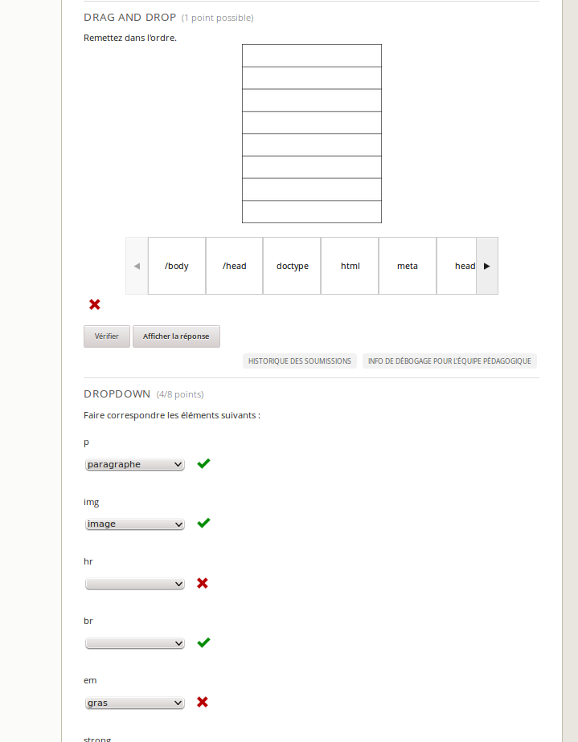
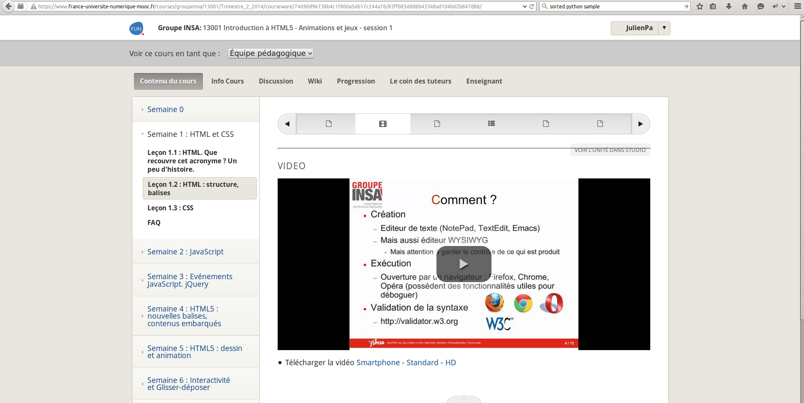
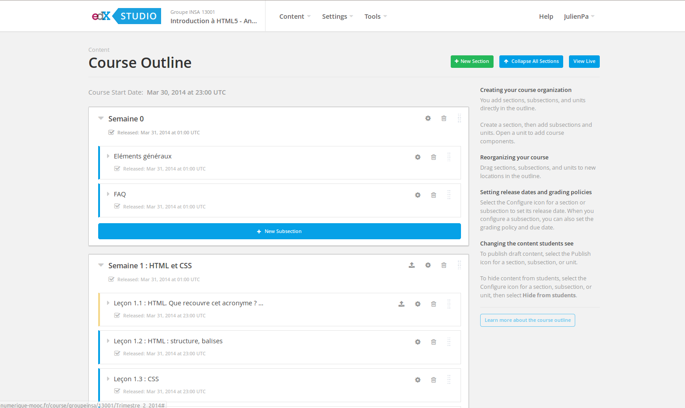
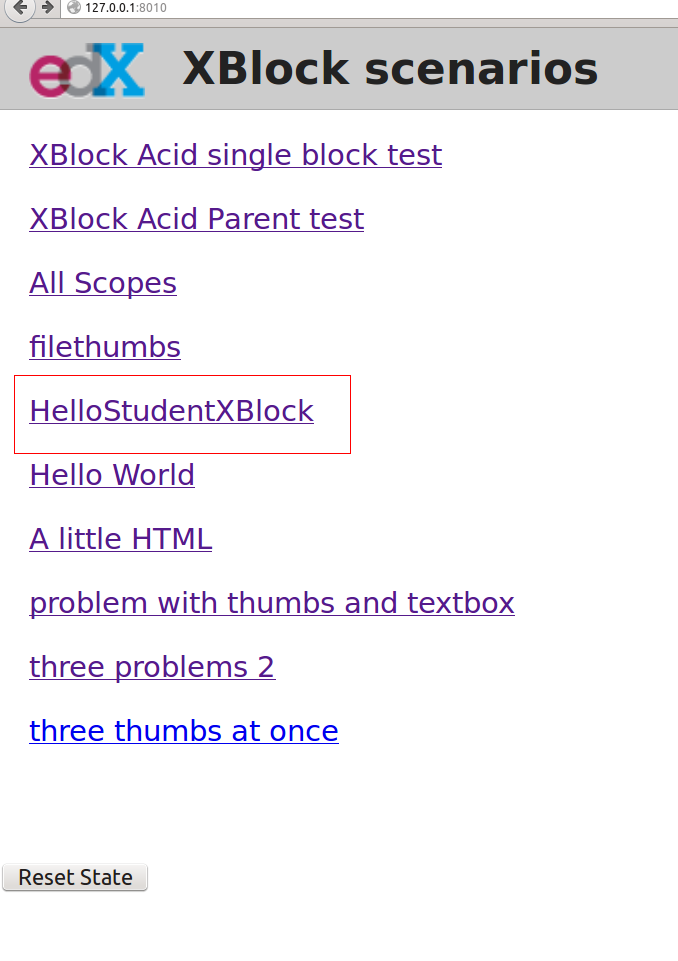
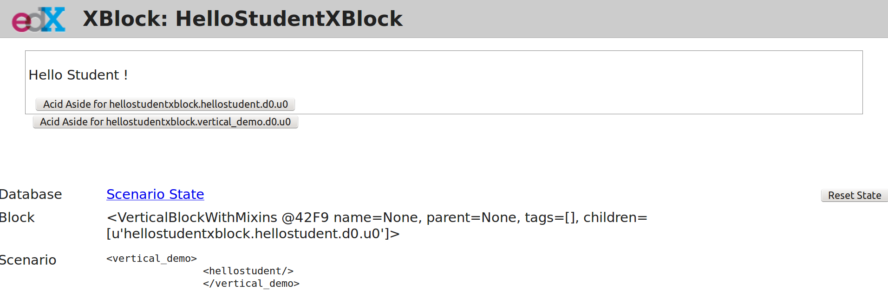
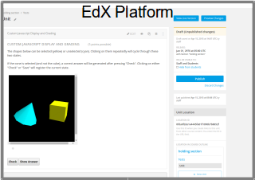
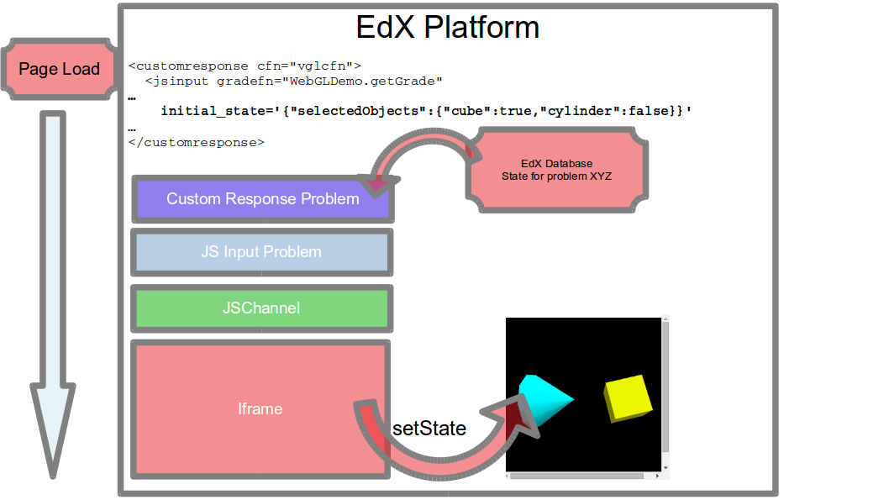
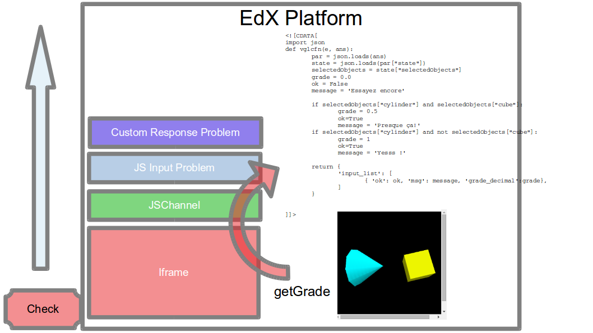
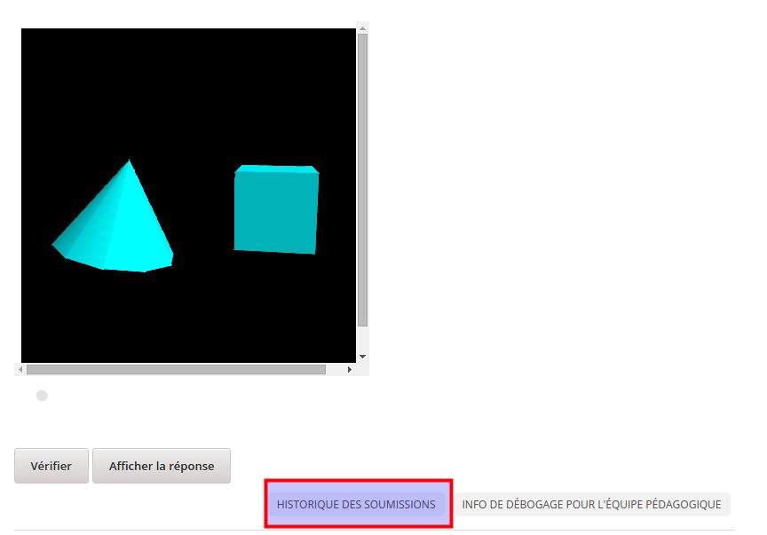

<!-- DO NOT EDIT THIS FILE DIRECTLY -->
<!-- It was generated using the "make markdown" command. Instead, edit the individual docs/*.md files. --> 

<h1 id="hackedx"><a href="#hackedx">Hack'edX</a></h1>
<ul>
<li><a href="#documentation">Comment lire cette documentation ?</a></li>
<li><a href="#presentation">Présentation générale</a></li>
<li><a href="#install">Installation de OpenFun / Edx</a></li>
<li><a href="#xblocks">Introduction aux XBlocks</a></li>
<li><a href="#js-input">Introduction à JS-Input</a></li>
<li><a href="#analytics">Faire du big data avec OpenFUN</a></li>
</ul>
<h1 id="documentation"><a href="#documentation">Comment lire cette documentation ?</a></h1>

La version pdf de cette documentation peut être téléchargée <a href="https://github.com/openfun/hackathon/raw/regisb/pdfdoc/static/hackathon.pdf">ici</a>.

Vous pouvez également générer vous-même cette documentation au format html et markdown en clonant le dépôt :

<pre><code>git clone https://github.com/openfun/hackathon
cd hackathon</code></pre>

Installez les dépendances nécessaires :

<pre><code>sudo apt-get install pandoc texlive texlive-lang-french</code></pre>

Générez la documentation au format markdown et html :

<pre><code>make</code></pre>
<h1 id="presentation"><a href="#presentation">Présentation générale</a></h1>

Edx est une platforme web qui permet de délivrer des cours en ligne ouverts à tous, les MOOCs - Massive Online Open Courses.

Les cours sont édités dans le « Studio ». Le Studio est une section réservée aux enseignants et aux personnes responsables de maintenir les cours. Il s'agit d'une interface web d'où l'on peut éditer les contenus de cours, gérer les vidéos et les autres ressources à destination des apprenants. Depuis le Studio, on peut gérer les calendriers de cours, gérer les barêmes de notation des apprenants, concevoir les quiz, etc.

Le LMS (Learning Management System), est la section publique de la plateforme Edx. Les cours qui sont édités dans le Studio sont publiés dans le LMS et disponibles aux apprenants. Le LMS est la partie la plus exposée et permet notamment aux apprenants de se connecter et de suivre leur cours. Il s'agit de https://www.france-universite-numerique-mooc.fr par exemple. Les apprenants peuvent s'inscrirent, consulter les cours, répondre aux quiz, accéder aux résultats, etc.

<h2 id="lms-et-studio"><a href="#lms-et-studio">LMS et Studio</a></h2>

Lorsque vous installez OpenFUN ou Open edX, vous aurez les deux &quot;sites&quot; LMS et Studio sur votre machine de dévelopement.

Les moocs ne sont pas composés uniquement de vidéos de cours. Ils s'accompagnent aussi de nombreuses activités, jeux...

Les étudiants suivent des moocs depuis le <em>LMS</em> (Learning Management System):

Et les professeurs concoivent ces moocs depuis un <em>CMS</em> (Content Management System), appelé aussi <em>Studio</em>:

<h1 id="install"><a href="#install">Installation d'une machine virtuelle OpenFUN / Edx</a></h1>

Les composants nécessaires à l'installation de FUN ou d'edX sont nombreux et relativement complexes ; c'est pourquoi il existe des machines virtuelles (VM) disponibles en simple téléchargement qui permettent de commencer rapidement à tester ces applications. Dans la suite de cette section, nous allons voir les étapes à suivre pour obtenir un environnement de développement fonctionnel.

<h3 id="téléchargement"><a href="#téléchargement">Téléchargement</a></h3>

Les VM OpenFUN sont disponibles au téléchargement via bittorrent. Si vous ne disposez pas d'un client bittorrent (tel que Transmission, Azure ou Deluge), vous devrez télécharger les VM en HTTP, ce qui risque d'être plus lent et de saturer les serveurs de FUN.

Les fichiers .torrent correspondant aux différentes version d'OpenFUN sont disponibles ici : http://files.alt.openfun.fr/vagrant-images/fun/

Vous pouvez télécharger le fichier openfun-*.torrent correspondant à la version la plus récente d'OpenFUN dans votre client bittorrent favori.

<h3 id="lancement-de-la-machine-virtuelle"><a href="#lancement-de-la-machine-virtuelle">Lancement de la machine virtuelle</a></h3>

Une fois que l'image d'OpenFUN est téléchargée, vous pouvez procéder à son lancement. Pour cela, clonez le dépôt fun-boxes et consultez le README :

<pre><code>git clone https://github.com/openfun/fun-boxes
cd fun-boxes
cat README.rst</code></pre>

Suivez les instructions pour l'installation des dépendances et le lancement de la release que vous avez téléchargée. Vous devrez notamment définir les variables d'environnement suivantes :

<pre><code>export VAGRANT_BOXES=/chemin/vers/mon/repertoire/de/torrents/
export FUN_RELEASE=2.11 # Si vous avez téléchargé la version 2.11 d&#39;OpenFUN</code></pre>
<h3 id="lancement-dun-serveur-web"><a href="#lancement-dun-serveur-web">Lancement d'un serveur web</a></h3>

Si vous avez correctement lancé votre machine virtuelle, vous pouvez maintenant vous y connecter via ssh et lancer un serveur web local :

<pre><code>######### Commande exécutée sur votre machine hôte
vagrant ssh

######### Commandes exécutées dans la VM

# La plupart des applications sont exécutées par l&#39;utilisateur edxapp
sudo su edxapp

# Cette commande réalise à la fois l&#39;installation des dépendances, la
# collecte des données statiques et le lancement de l&#39;application LMS
fun lms.dev run</code></pre>

Ouvrez maintenant votre navigateur (de votre machine hôte) à l'adresse http://127.0.0.1:8000 : vous devriez voir apparaître la page d'accueil de FUN. Win!

<pre><code># Pour sauter les phases de vérification de l&#39;environnement, vous pouvez
# exécuter à la place de la commande précédente :
fun lms.dev run --fast

# De même, dans un autre terminal, vous pouvez lancer le Studio/CMS :
fun cms.dev run --fast</code></pre>

Le Studio/CMS est alors visible à l'adresse http://127.0.0.1:8001.

Vous pouvez également lancer les tests associés à FUN :

<pre><code># Notez que les settings de test sont différents de ceux de dev
fun lms.test test ../fun-apps/</code></pre>

Sous le capot, 'fun' est un raccourci permettant d'exécuter une variété de commandes. Pour plus d'informations, consultez la documentation de fun-cmd : https://github.com/openfun/fun-cmd

<h1 id="xblocks"><a href="#xblocks">Mon premier Xblock 'Hello Student!'</a></h1>

Les XBlocks enrichissent les contenu de cours : il existe des XBlock pour afficher des vidéos dans le cours, pour y insérer des quiz, pour permettre des discussions de forum, ou même pour exécuter des lignes code. Edx met à disposition un SDK qui aide à la création de XBlocks. Ainsi, il est possible commencer le développement de vos modules XBlock sans avoir à installer la platforme Edx.

Vous trouverez dans ce guide, les instructions pour installer le SDK et pour créer votre premier XBlock.

<h3 id="installer-python"><a href="#installer-python">Installer Python</a></h3>
<pre><code>sudo apt-get install python</code></pre>
<h3 id="installer-pip"><a href="#installer-pip">Installer Pip</a></h3>

Pip est un gestionnaire de dépendance python.

Pour une installation sous Debian/Ubuntu

<pre><code> sudo apt-get install python-pip</code></pre>

Une autre façon d'installer pip en téléchargeant le script <code>https://bootstrap.pypa.io/get-pip.py</code>:

<pre><code>wget https://bootstrap.pypa.io/get-pip.py -P /tmp/ &amp;&amp; sudo python /tmp/get-pip.py</code></pre>
<h3 id="installer-le-xblock-sdk-depuis-le-dépot-github"><a href="#installer-le-xblock-sdk-depuis-le-dépot-github">Installer le xblock sdk depuis le dépot Github</a></h3>

Création de l'environnement virtuel :

<pre><code>sudo apt-get install python-virtualenv
mkdir -p ~/venvs/
virtualenv ~/venvs/xblock-sdk
source ~/venvs/xblock-sdk/bin/activate</code></pre>

Installation du xblock sdk :

<pre><code>cd ~/
git clone https://github.com/edx/xblock-sdk.git
cd ~/xblock-sdk/
make install
python manage.py syncdb</code></pre>
<h3 id="lancer-le-serveur-de-développement"><a href="#lancer-le-serveur-de-développement">Lancer le serveur de développement</a></h3>
<pre><code>python manage.py runserver 0.0.0.0:8001</code></pre>

Maintenant depuis votre navigateur allez à cette adresse 127.0.0.1:8001. Si tout va bien la page suivante devrait apparaître :

<h3 id="créons-la-structure-de-notre-xblock"><a href="#créons-la-structure-de-notre-xblock">Créons la structure de notre xblock</a></h3>
<pre><code># Le code du xblock sera dans le dossier ~/xblock-dev/
mkdir ~/xblock-dev/
cd ~/xblock-dev/
python ~/xblock-sdk/script/startnew.py </code></pre>

Le script demande d'abord un nom court pour notre xblock, choisissons 'hellostudent'. Ensuite rentrons le nom de classe 'HelloStudentXBlock'

Nous avons maitenant un dossier 'hellostudent' contenant la structure du XBlock.

<h3 id="afficher-hello-student"><a href="#afficher-hello-student">Afficher 'Hello student'</a></h3>

Ouvrons le fichier <code>hellostudent/static/html/hellostudent.html</code> et remplaçons son contenu par :

<pre><code>&lt;div class=&quot;hellostudent_block&quot;&gt;
    &lt;p&gt;
         Hello Student !
     &lt;/p&gt;
&lt;/div&gt;</code></pre>
<h3 id="enregistrer-notre-xbock-dans-le-workbench."><a href="#enregistrer-notre-xbock-dans-le-workbench.">Enregistrer notre xbock dans le workbench.</a></h3>

Pour afficher notre xblock il est nécessaire de l'installer dans l'environnement de travail, le 'workbench'. L'installation est contrôlée par le fichier <code>setup.py</code> qu'il faudra modifier pour l'adapter à nos besoins.

<pre><code># Se mettre dans l&#39;environnement virtuel avant l&#39;installation du paquet.
source ~/venvs/xblock-sdk/bin/activate
cd ~/xblock-dev/hellostudent/
pip install -e .</code></pre>

Ici, nous travaillons dans le contexte du SDK, mais sachez que ce même principe utilisant <code>pip install</code> est utilisé pour installer un XBlock dans la plateforme Edx.

Vous devriez maintenant avoir un environnement minimal complet.

Pour rappel, les commandes pour démarrer le serveur :

<pre><code>source ~/venvs/xblock-sdk/bin/activate
cd ~/xblock-dev/hellostudent/
python manage.py runserver 0.0.0.0:8001</code></pre>

Voici ce que vous devriez voir:

<h3 id="liens-utiles"><a href="#liens-utiles">Liens utiles:</a></h3>

La documentation officielle mais en cours de construction. http://xblock.readthedocs.org/en/latest/

Un tutoriel pour lire et enregistrer des vidéos depuis un xblock. http://opencraft.com/doc/edx/xblock/tutorial.html

Une liste des xblocks déjà existants. https://github.com/edx/edx-platform/wiki/List-of-XBlocks

<h1 id="js-input"><a href="#js-input">JS-Input</a></h1>
<h2 id="introduction"><a href="#introduction">Introduction</a></h2>

Une activité Open edX peut aller de la simple page HTML aux quiz et évaluations par les pairs. Le JS-Input est une spécificité d'OpenedX permettant d'étendre les types d'activités disponibles sur la plateforme.

Bien qu'Open edX offre beaucoup de types d'activités différentes aux créateurs de cours, &quot;beaucoup&quot; n'est souvent pas assez pour l'ensemble des acteurs de la plateforme. Pour répondre à la demande des MOOC, il faut souvent créer de multiple types d'activités afin d'éviter l'aspect répétitif et permettre au cours d'être suivi avec plus d'engouement. Il ne faut pas être limité à un choix toujours trop réduit de types de quiz.

Open edX propose de résoudre ce problème en mettant à portée du développeur/concepteur deux technologies:

<ul>
<li>Le <a href="#xblocks">Xblock</a> (voir documentation spécifique): une extension en python qui doit être installée sur le serveur qui héberge la plateforme. C'est probablement la meilleure solution si vous avez accès au serveur.</li>
<li>Le JS-Input: probablement moins flexible en terme de possibilités offertes, mais probablement la réponse à de nombreux besoins. Le JS-Input a l'avantage d'être une extension dont l'installation se fait directement dans un cours sans nécéssiter un accès au serveur.</li>
</ul>

En gros une activité JS-Input c'est : une page HTML avec un peu de Javascript !

Dans ce document nous allons expliquer comment construire une simple application JS-Input assez générique pour comprendre les mécanismes de base.

<h2 id="les-mécanismes-de-base"><a href="#les-mécanismes-de-base">Les mécanismes de base</a></h2>

Tout d'abord, voici à quoi ressemble un problème de ce type dans studio:

Exemple d'activité dans studio

Les paramètres de l'activité dans studio sont les suivants:

<pre><code>&lt;problem&gt;
       &lt;script type=&quot;loncapa/python&quot;&gt;
def all_true(exp, ans): return ans == &quot;hi&quot;
       &lt;/script&gt;
       &lt;customresponse cfn=&quot;all_true&quot;&gt;
           &lt;jsinput gradefn=&quot;gradefn&quot;
               height=&quot;500&quot;
               get_statefn=&quot;getstate&quot;
               set_statefn=&quot;setstate&quot;
               html_file=&quot;/static/jsinput.html&quot;/&gt;
       &lt;/customresponse&gt;
&lt;/problem&gt;</code></pre>

On peut en déduire que les étapes clés dans l'instanciation d'une activité JS-Input sont :

<ul>
<li>Le chargement de l'activité et restauration de l'état intial: <code>set_statefn</code></li>
<li>Les actions de vérification du problème côté Open edX: <code>gradefn</code></li>
<li>Les actions de changement : de note ou d'état <code>get_statefn</code> et <code>gradefn</code></li>
</ul>
<h3 id="chargement-de-lactivité-et-initialisation-de-létat"><a href="#chargement-de-lactivité-et-initialisation-de-létat">Chargement de l'activité et initialisation de l'état</a></h3>

L'activité se charge dans la page de cours et utilise différents modules internes à Open edX.

Le module principal est &quot;Custom Response Problem&quot; qui est le module générique dans Open edX, permettant d'évaluer une réponse de manière programmatique. L'autre module est appelé JSChannel et permet à l'application JS-Input de communiquer avec Open edX. Nous allons revenir en détail vers ces deux modules dans un autre chapitre.

Pour l'instant occupons-nous du processus décrit sur ce schéma:

Lorsque la page se charge, Open edX retrouve le dernier état de l'application pour un utilisateur donné. Cet état se présente sous la forme d'une information codée en JSON. Le format de cette information est particulière à l'application JS-Input (seule elle la comprend en réalité). Sa signification est définie par le créateur de l'activité.

Si aucun &quot;état&quot; (JSON) pour l'utilisateur n'est trouvé et que l'on a spécifié un état initial, celui-ci est chargé et présenté à l'application JS-Input par un appel à la fonction &quot;setState&quot;.

<h3 id="vérification-du-problème-coté-open-edx"><a href="#vérification-du-problème-coté-open-edx">Vérification du problème coté Open edX</a></h3>

La routine de vérification d'un problème est activée par l'appui de l'utilisateur sur le bouton &quot;Vérifier&quot; (ou &quot;Check&quot; en Anglais). C'est seulement cette action qui déclenchera la séquence de vérification.

Ce qui se passe:

<ul>
<li>Le conteneur JS Input Problem envoie un &quot;Get grade&quot; pour récupérer une l'information d'état de l'activité encodée en JSON. Il appellera aussi la fonction &quot;Get State&quot; si elle existe pour stocker l'état actuel de l'utilisateur.</li>
<li>L'information passe à travers toutes les couches logicielles (JSChannel, JS Input Problem) et vers edX</li>
<li>Le script python intégré à l'activité JS-Input dans Open edX est lancé pour vérifier le résultat, et renvoie une information sous forme de note</li>
<li>Le résultat est renvoyé vers le serveur edX</li>
</ul>

Ensuite le résultat est stocké dans la base de donnée Open edX avec :

<ul>
<li>des informations sur le temps exact de soumission,</li>
<li>un objet <code>correct_map</code> qui permet de stocker le status (correct ou non) de la réponse après analyse par le script python de l'exercice.</li>
</ul>

Vous pouvez voir l'historique des soumissions grâce au bouton &quot;Historique des soumissions&quot; situé au dessous de l'activité (seulement accessible par l'enseignant).

Cet historique va donner des résultats comme ceux-ci (application d'exemple Javascript) :

<pre><code>#4: 2015-05-11 20:46:34+00:00 (Europe/Paris time)

Score: 1.0 / 1.0
{
  &quot;attempts&quot;: 1,
  &quot;correct_map&quot;: {
    &quot;i4x-FUN-FUN101-problem-2d1cf6dd9012475ebf3d6295ccb1da72_2_1&quot;: {
      &quot;correctness&quot;: &quot;correct&quot;,
      &quot;hint&quot;: &quot;&quot;,
      &quot;hintmode&quot;: null,
      &quot;msg&quot;: &quot;&quot;,
      &quot;npoints&quot;: 1,
      &quot;queuestate&quot;: null
    }
  },
  &quot;done&quot;: true,
  &quot;input_state&quot;: {
    &quot;i4x-FUN-FUN101-problem-2d1cf6dd9012475ebf3d6295ccb1da72_2_1&quot;: {}
  },
  &quot;last_submission_time&quot;: &quot;2015-05-11T20:46:34Z&quot;,
  &quot;seed&quot;: 1,
  &quot;student_answers&quot;: {
    &quot;i4x-FUN-FUN101-problem-2d1cf6dd9012475ebf3d6295ccb1da72_2_1&quot;: &quot;{\&quot;answer\&quot;:\&quot;{\\\&quot;cylinder\\\&quot;:true,\\\&quot;cube\\\&quot;:false}\&quot;,\&quot;state\&quot;:\&quot;{\\\&quot;selectedObjects\\\&quot;:{\\\&quot;cylinder\\\&quot;:true,\\\&quot;cube\\\&quot;:false}}\&quot;}&quot;
  }
}</code></pre>
<h3 id="mécanismes-de-retour-dinformation"><a href="#mécanismes-de-retour-dinformation">Mécanismes de retour d'information</a></h3>

Il existe un troisième mécanisme de retour d'information appelé <code>get_statefn</code>. Dans la pratique, on peut se baser sur le retour de la note (qui peut donner bien plus qu'un état de note, mais aussi une idée de l'état de l'application). Dans ce cas, on va pouvoir définir une fonction de l'application qui est appelée lorsque l'on requiert un statut sur l'application. Dans ce cas la réponse de l'application devra comporter deux champs: <code>answer</code> et <code>state</code>.

Exemple:

<pre><code>{  
   &quot;answer&quot;:&quot;{&quot;cylinder&quot;:true,&quot;cube&quot;:false}&quot;,
   &quot;state&quot;:&quot;{&quot;selectedObjects&quot;:{&quot;cylinder&quot;:true,&quot;cube&quot;:false}}&quot;
}</code></pre>
<h2 id="les-modules"><a href="#les-modules">Les modules</a></h2>
<h3 id="custom-response-problem-et-js-input-problem"><a href="#custom-response-problem-et-js-input-problem">Custom Response Problem et JS Input Problem</a></h3>

Ces deux types de problèmes sont des modules permettant de vérifier la réponse utilisateur par un petit script python avant l'enregistrement réel sur Open edX. Ceci permet de faire pas mal de choses notamment de noter de manière plus souple tout en restant automatique.

La documentation est diponible ici : <a href="https://github.com/Stanford-Online/js-input-samples">https://github.com/Stanford-Online/js-input-samples</a>

<h3 id="jschannel"><a href="#jschannel">JSChannel</a></h3>

JSChannel est un wrapper créé par Mozilla pour faciliter la communication entre pages et iframes (voir <code>window.postMessage</code> : <a href="https://developer.mozilla.org/en-US/docs/Web/API/Window/postMessage">https://developer.mozilla.org/en-US/docs/Web/API/Window/postMessage</a>). La bibliothèque JS Channel facilite ce travail : <a href="https://github.com/mozilla/jschannel">https://github.com/mozilla/jschannel</a>.

<h2 id="trucs-et-astuces"><a href="#trucs-et-astuces">Trucs et astuces</a></h2>
<h3 id="intégrer-du-js-input-directement-de-github"><a href="#intégrer-du-js-input-directement-de-github">Intégrer du JS Input directement de github</a></h3>

Lorsque l'on développe une extension, il est assez pratique d'avoir une version de l'application externe en cours sur un site externe. Sinon on est obligé de recharger les fichiers correspondants à chaque mise à jour.

Pour cela il est pratique d'utiliser le lien provenant directement de gihub sur les resources : <a href="https://rawgit.com/">https://rawgit.com/</a>

<h3 id="faire-une-activité-qui-retourne-une-note-différente-de-0-ou-1"><a href="#faire-une-activité-qui-retourne-une-note-différente-de-0-ou-1">Faire une activité qui retourne une note différente de 0 ou 1</a></h3>
<pre><code>&lt;![CDATA[
import json
def vglcfn(e, ans):
    par = json.loads(ans)
    state = json.loads(par[&quot;state&quot;])
    selectedObjects = state[&quot;selectedObjects&quot;]
    grade = 0.0
    ok = False
    message = &#39;Essayez encore&#39;

    if selectedObjects[&quot;cylinder&quot;] and selectedObjects[&quot;cube&quot;]:
        grade = 0.5
        ok=True
        message = &#39;Presque ça!&#39;
    if selectedObjects[&quot;cylinder&quot;] and not selectedObjects[&quot;cube&quot;]:
        grade = 1
        ok=True
        message = &#39;Yesss !&#39;

    return {
        &#39;input_list&#39;: [
            { &#39;ok&#39;: ok, &#39;msg&#39;: message, &#39;grade_decimal&#39;:grade},
        ]
    }
]]&gt;</code></pre>
<h3 id="liens-utiles-1"><a href="#liens-utiles-1">Liens utiles</a></h3>
<ul>
<li>Documentation de l'activité JS Input: <a href="http://edx-partner-course-staff.readthedocs.org/en/latest/exercises_tools/custom_javascript.html">http://edx-partner-course-staff.readthedocs.org/en/latest/exercises_tools/custom_javascript.html</a></li>
<li>Documentation identique mais orientée développeur : <a href="http://edxpdrlab.readthedocs.org/en/latest/course_data_formats/jsinput.html">http://edxpdrlab.readthedocs.org/en/latest/course_data_formats/jsinput.html</a></li>
<li>Custom Python evaluated problem (Version générique du JS Input) : <a href="http://edx-partner-course-staff.readthedocs.org/en/latest/exercises_tools/custom_python.html">http://edx-partner-course-staff.readthedocs.org/en/latest/exercises_tools/custom_python.html</a></li>
<li>Stanford JS Input Samples : <a href="https://github.com/Stanford-Online/js-input-samples">https://github.com/Stanford-Online/js-input-samples</a></li>
</ul>
<h1 id="analytics"><a href="#analytics">Analytics</a></h1>
<h2 id="introduction-1"><a href="#introduction-1">Introduction</a></h2>

FUN met à la disposition des participants au hackathon une quantité de logs extraits de ses machines de productions à fins d'analyse.

<h2 id="téléchargement-des-fichiers-de-logs"><a href="#téléchargement-des-fichiers-de-logs">Téléchargement des fichiers de logs</a></h2>

TODO

<h2 id="source-des-logs"><a href="#source-des-logs">Source des logs</a></h2>

Les logs proviennent des appels à <code>tracker.emit</code> qui parsèment le code d'edX et de FUN : https://github.com/edx/event-tracking/blob/0.2.0/eventtracking/tracker.py#L65

Chaque évènement loggé se présente sous la forme d'un blob JSON contenant au moins un champ <code>time</code>.

<h2 id="format-des-logs"><a href="#format-des-logs">Format des logs</a></h2>

Les logs fournis par FUN sont anonymisés, ce qui signifie que les champs <code>email</code>, <code>address</code>, etc. ont été retirés des blobs JSON. Par ailleurs, le champs <code>username</code> a été chiffré à l'aide d'une méthode de chiffrage à sens unique :

<pre><code>encrypted_username = hmac.new(secret_key, username, hashlib.sha256).hexdigest()</code></pre>
<h2 id="analyse-des-logs-à-laide-de-elasticsearch"><a href="#analyse-des-logs-à-laide-de-elasticsearch">Analyse des logs à l'aide de ElasticSearch</a></h2>

Les logs fournis par FUN se prêtent particulièrement bien à l'analyse via ElasticSearch. Si vous décidez de charger les logs fournis dans un cluster ElasticSearch, nous vous recommandons d'installer la pile ELK : ElasticSearch + Logstash + Kibana.

<ul>
<li>ElasticSearch est le moteur d'indexation et de recherche de vos données.</li>
<li>Kibana est le frontend qui vous permettra de visualiser vos données dans le navigateur.</li>
<li>Logstash permet d'envoyer vos logs à ElasticSearch en les convertissant en évènements au format ad-hoc.</li>
</ul>
<h3 id="installation"><a href="#installation">Installation</a></h3>

L'installation des trois composants de la stack ELK est bien documentée :

<ul>
<li>https://www.elastic.co/downloads/elasticsearch</li>
<li>https://www.elastic.co/downloads/logstash</li>
<li>https://www.elastic.co/downloads/kibana</li>
</ul>
<h3 id="envoi-des-logs-vers-elasticsearch"><a href="#envoi-des-logs-vers-elasticsearch">Envoi des logs vers ElasticSearch</a></h3>

Une fois que vous avez correctement installé Logstash et ElasticSearch, vous pouvez insérer les logs de FUN dans ElasticSearch à l'aide du fichier de configuration <code>logstash.conf</code> fourni dans ce dépôt :

<pre><code>cat fun_tracking_logs.log | logstash --config static/logstash.conf</code></pre>
<h3 id="visualisation-des-résultats-dans-kibana"><a href="#visualisation-des-résultats-dans-kibana">Visualisation des résultats dans Kibana</a></h3>

Après avoir inséré quelques évènements dans ElasticSearch, vous pouvez lancer Kibana et observer ces évènements en ouvrant <a href="http://localhost:5601">http://localhost:5601</a> dans votre navigateur. N'oubliez pas de sélectionner un intervalle de temps couvert par les logs (en haut à droite).

<h3 id="réaliser-des-requêtes-manuelles-sur-elasticsearch"><a href="#réaliser-des-requêtes-manuelles-sur-elasticsearch">Réaliser des requêtes manuelles sur ElasticSearch</a></h3>

Vous pouvez souhaiter réaliser des requêtes complexes sur ElasticSearch et en récupérer le résultat brut au format JSON sans passer par Kibana. Pour ça, le mieux est de :

<ol style="list-style-type: decimal">
<li>créer une requête via Kibana, dans l'onglet &quot;Discover&quot;.</li>
<li>récupérer cette requête au format JSON, en repliant le graphe de résultats, puis sous l'onglet &quot;Request&quot;. Par exemple :</li>
</ol>
<pre><code>{
  &quot;size&quot;: 500,
  &quot;sort&quot;: {
    &quot;@timestamp&quot;: &quot;desc&quot;
  },
  &quot;query&quot;: {
    &quot;filtered&quot;: {
      &quot;query&quot;: {
        &quot;query_string&quot;: {
          &quot;query&quot;: &quot;*&quot;,
          &quot;analyze_wildcard&quot;: true
        }
      }
    }
  }
}</code></pre>
<ol start="3" style="list-style-type: decimal">
<li>
Copier-coller cette requête dans un fichier <code>query.json</code>, puis réaliser la requête à l'aide du script fourni dans ce dépôt :

static/es.py query.json &gt; result.json
</li>
</ol>
